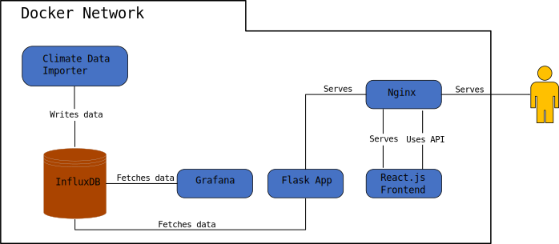

[](http://climatediary.ddns.net:9000/) [](https://github.com/dean-dalianis/dataVisualisation/blob/master/LICENSE)

# Climate Diary

The Climate Diary is an open-source project designed to aggregate, simplify, and visualize complex climate data. The platform makes this information accessible and easy to understand, fostering meaningful climate change discussions among a broad audience, from scientists and policymakers to students and the general public. Future enhancements include expanding the diversity of data, integrating real-time data sources, and conducting rigorous assessments of data quality and relevance. Additionally, a comprehensive technical evaluation will optimize the platform's software stack, potentially exploring alternatives for data storage, stream processing, backend and frontend programming, and data visualization. As an open-source initiative, the Climate Diary warmly welcomes contributions from the wider community for continuous improvement and innovation. Furthermore, the platform is open to potential collaborations in the future to enrich its data sources and strengthen its impact.

This repository contains multiple projects that

- fetch and write climate data to an InfluxDb database for world's countries
- provide an API to access the data
- provide a web application to visualize the data
- provide a Grafana instance to visualize the data

Each project has its own README file with more detailed documentation.

## Climate Data

### Available measurements

The project uses NOAA's Global Summary of the Year(GSOY) data, directly from
the [NOAA GSOY archive](https://www.ncei.noaa.gov/data/gsoy/archive/gsoy-latest.tar.gz).

It currently supports a limited set of measurements and it currently doesn't store information about the stations , due
to memory constraints, but it can be easily extended to support more measurements and information.

The measurements currently supported are:

- **DSNW**: Number of days with Snowfall
- **DYFG**: Number of days with Fog
- **DYTS**: Number of days with Thunder
- **EMNT**: Extreme minimum temperature
- **EMSD**: Highest daily snow depth
- **EMSN**: Highest daily snowfall
- **EMXP**: Extreme maximum precipitation
- **EMXT**: Extreme maximum temperature
- **EVAP**: Total evaporation
- **PRCP**: Precipitation
- **SNOW**: Total Snowfall
- **TAVG**: Average Temperature
- **TMAX**: Maximum Temperature
- **TMIN**: Minimum Temperature

### Data trends

InfluxDB 2.* introduces Flux as a query language. Flux is a functional data scripting language designed for querying,
analyzing, and acting on data. It is used by InfluxDB to process data for visualization in Grafana.

This allows us to easily query the database and generate data trends in the visualizations on the fly.

## Overview

<picture>
  <source media="(prefers-color-scheme: dark)" srcset="flow_chart/diagram_dark.svg">
  <source media="(prefers-color-scheme: light)" srcset="flow_chart/diagram_light.svg">
  
</picture>

The project consists of a multi-component web application aimed at fetching and providing access to climate data
visualization. The architecture is as follows:

1. **Nginx Server:** This is the web server for the application. It handles incoming requests and routes them to the
   appropriate component, either the Flask server or the ReactJS frontend.

2. **ReactJS Frontend:** This is the client-side user interface of the application. It interacts with the backend
   services to fetch and display the climate data to users.

3. **Flask Server:** A server-side service that interacts with the application's database (InfluxDB) to fetch and
   process the climate data as required.

4. **GSOY importer:** This module is responsible for fetching climate data from the NOAA GSOY archive. After obtaining
   this data, it stores it in the InfluxDB for later retrieval and analysis. It is run as a cron job every 15 days.

5. **InfluxDB:** This is the database that houses all the climate data fetched from the NOAA GSOY archive. It is
   accessed by both the Flask Server (to provide data to the frontend) and Grafana (for data analysis).

6. **Grafana:** This component is a data visualization tool. It fetches data from InfluxDB and generates intuitive,
   visual representations of the climate data for analysis. It is used inside ReactJS frontend as multiple iframes.

## Docker

The project uses Docker to run all the services. The services are defined in the `docker-compose.yml`.

### Services

The services included in the stack are:

1. **influxDB**: A time series database for storing metrics and time-based data.
2. **grafana**: A platform for visualizing and analyzing metrics with customizable dashboards and plugins.
3. **gsoy_importer**: A Python script for fetching the data from NOAA and writing it to the InfluxDB database.
4. **frontend**: The React app for the diary.
5. **backend**: The API for the diary app.
6. **nginx**: A web server for serving the frontend and backend.

### Running the Stack

To run the stack, follow these steps:

1. Clone this repository to your local system.

2. Create a `.env` file in the root directory of the project and add the following environment variables to it:

    ```yml
    DB_ADMIN_PASSWORD=changeme
    DB_INIT_ORG=CLIMATE
    DB_INIT_BUCKET=climate-bucket
    DB_ADMIN_TOKEN=<An InfluxDB 2.* token>
    ```
3. Create a `.env` file in the diary directory and add the following environment variables to it:

    ```yml
    VITE_API_URL = localhost:8000/
    VITE_GRAFANA_URL = localhost:3000/    
   ```

4. Run the following command to start the containers:

    ```bash
    docker compose --env-file ./.env -f ./docker-compose.yml up --remove-orphans --build
    ```

   If you need to start containers selectively (e.g. the influxdb & grafana or any other combination):
   ```bash
   docker compose --env-file ./.env -f ./docker-compose.yml up --remove-orphans --build influxdb grafana
    ```

   If you need to clean-up docker deployments:

    ```bash
    docker-compose --env-file ./.env -f ./docker-compose.yml down --volumes --remove-orphans
    ```

5. After the containers are up and running, you can access the following services:

    - influxDB: [http://localhost:8086](http://localhost:8086)
    - grafana: [http://localhost:3000](http://localhost:3000)
    - frontend: [http://localhost:9000](http://localhost:8081)
    - backend: [http://localhost:8000](http://localhost:8000)

6. To stop the containers, run the following command:

    ```bash
    docker-compose down
    ```

### Configuration

The Docker and service configuration files for all the services are stored in their respective directories:

- **grafana**:
    - `grafana/grafana.ini`
    - `grafana/provisioning/*`
- **gsoy_importer**: `gsom_fetcher/Dockerfile`
- **frontend**: `diary/Dockerfile`
- **backend**: `diary_api/Dockerfile`
- **nginx**:
    - `nginx/nginx.conf`
    - `nginx/conf.d/*`
